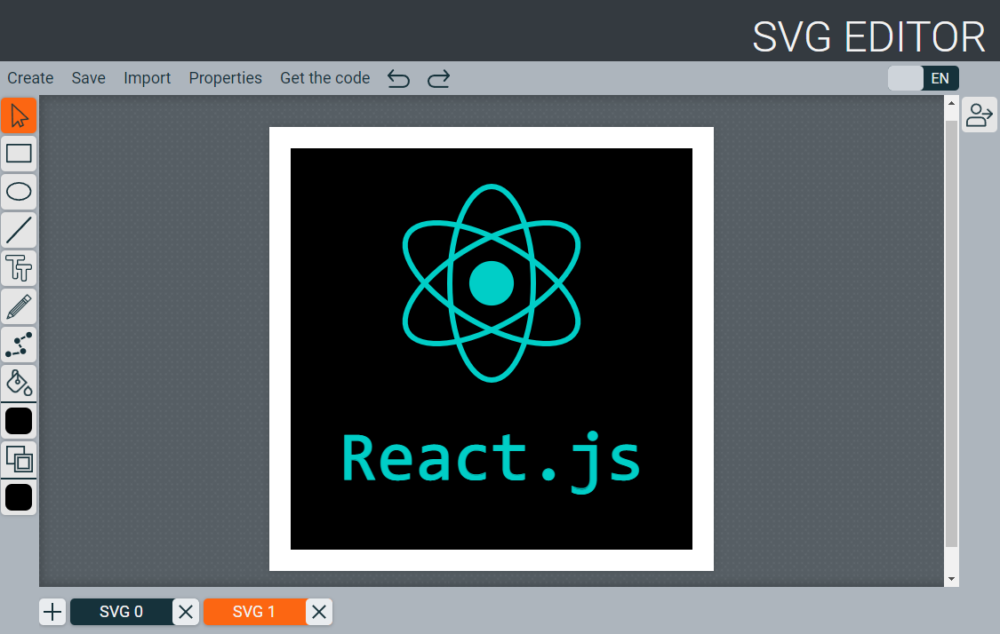

# [SVG-Editor](https://gtm003.github.io/rsclone/client/build/index.html)

Это командная работа - финальное задание курса Front-end/JavaScript RS School. Ссылка на ТЗ [здесь](https://github.com/rolling-scopes-school/tasks/blob/master/tasks/rsclone/rsclone.md). 

## Технологии используемые в разработке:
### Код клиентской части написан на JS, а также
* использованы библиотеки [SVG.js](https://svgjs.dev/docs/3.0/) и ее плагины для select, resize, path – для реализации одноименных функций
* для стилизации использован препроцессор SASS
* при именовании классов старались использовать методологию БЭМ
* SVG изображения, используемые для оформления внешнего вида приложения, импортируются через svg-спрайт
* последнее состояние приложения и всех его вкладок сохраняется на клиенте в localStorage
* в разработке архитектуры приложения опирались на паттерн проектирования MVC 
* для контроля качества подключен и использован eslint 
* для сборки используется gulp и webpack
* внешний вид приложения реализован в Figme

### Для реализации серверной части используется технологии:
* платформа Node js
* фреймворк Express js
* Rest API
* База данных Postgre sql
* Бэкенд написан на Typescipt
* Библиотека Knex JS
